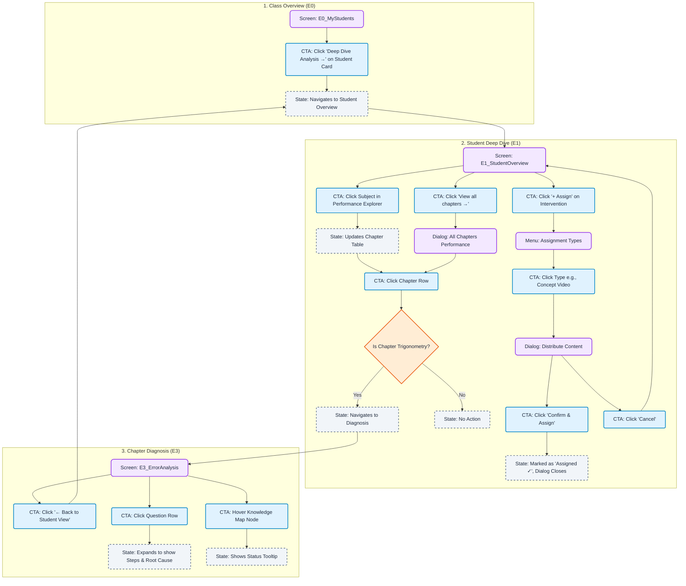

# Educator Dashboard UX Task Flow

This document maps the user interactions across the Educator Dashboard screens (`E0_MyStudents.jsx`, `E1_StudentOverview.jsx`, `E3_ErrorAnalysis.jsx`).

```mermaid
graph TD
    %% Styling Classes
    classDef screen fill:#f3e8ff,stroke:#9333ea,stroke-width:2px,color:#1e293b,rx:8px,ry:8px
    classDef cta fill:#e0f2fe,stroke:#0284c7,stroke-width:2px,color:#1e293b,rx:4px,ry:4px
    classDef state fill:#f1f5f9,stroke:#64748b,stroke-width:2px,stroke-dasharray: 5 5,color:#1e293b,rx:4px,ry:4px
    classDef decision fill:#ffedd5,stroke:#ea580c,stroke-width:2px,color:#1e293b,shape:diamond
    classDef endpt fill:#dcfce7,stroke:#16a34a,stroke-width:2px,color:#1e293b,rx:30px,ry:30px

    %% ==========================================
    %% E0: My Students Flow
    %% ==========================================
    subgraph E0_MyStudents ["1. Class Overview (E0)"]
        E0_Screen[Screen: E0_MyStudents]:::screen
        E0_Screen --> E0_ClickCard[CTA: Click 'Deep Dive Analysis →' on Student Card]:::cta
        E0_ClickCard --> E1_Screen[State: Navigates to Student Overview]:::state
    end

    %% ==========================================
    %% E1: Student Overview Flow
    %% ==========================================
    subgraph E1_StudentOverview ["2. Student Deep Dive (E1)"]
        E1_Screen --> E1_Main[Screen: E1_StudentOverview]:::screen
        
        %% Performance Explorer Path
        E1_Main --> E1_ClickSubj[CTA: Click Subject in Performance Explorer]:::cta
        E1_ClickSubj --> E1_SubjState[State: Updates Chapter Table]:::state
        
        E1_Main --> E1_ClickViewAll[CTA: Click 'View all chapters →']:::cta
        E1_ClickViewAll --> E1_ModalAll[Dialog: All Chapters Performance]:::screen
        
        E1_SubjState --> E1_ClickChap[CTA: Click Chapter Row]:::cta
        E1_ModalAll --> E1_ClickChap
        E1_ClickChap --> E1_ChapDecision{Is Chapter Trigonometry?}:::decision
        E1_ChapDecision -- Yes --> E3_ScreenState[State: Navigates to Diagnosis]:::state
        E1_ChapDecision -- No --> E1_ChapNone[State: No Action]:::state
        
        %% Interventions Path
        E1_Main --> E1_ClickAssign[CTA: Click '+ Assign' on Intervention]:::cta
        E1_ClickAssign --> E1_MenuAssign[Menu: Assignment Types]:::screen
        
        E1_MenuAssign --> E1_SelectType[CTA: Click Type e.g., Concept Video]:::cta
        E1_SelectType --> E1_ModalAssign[Dialog: Distribute Content]:::screen
        
        E1_ModalAssign --> E1_ConfirmAssign[CTA: Click 'Confirm & Assign']:::cta
        E1_ModalAssign --> E1_CancelAssign[CTA: Click 'Cancel']:::cta
        
        E1_CancelAssign --> E1_Main
        E1_ConfirmAssign --> E1_AssignedState[State: Marked as 'Assigned ✓', Dialog Closes]:::state
    end

    %% ==========================================
    %% E3: Error Analysis Flow
    %% ==========================================
    subgraph E3_ErrorAnalysis ["3. Chapter Diagnosis (E3)"]
        E3_ScreenState --> E3_Main[Screen: E3_ErrorAnalysis]:::screen
        
        %% Back Navigation
        E3_Main --> E3_Back[CTA: Click '← Back to Student View']:::cta
        E3_Back --> E1_Screen
        
        %% Error Step Analysis
        E3_Main --> E3_ClickQ[CTA: Click Question Row]:::cta
        E3_ClickQ --> E3_ExpandQ[State: Expands to show Steps & Root Cause]:::state
        
        %% Gap Map
        E3_Main --> E3_HoverNode[CTA: Hover Knowledge Map Node]:::cta
        E3_HoverNode --> E3_ShowTooltip[State: Shows Status Tooltip]:::state
    end
```
