# Parent Dashboard UX Task Flow

This document maps the user interactions for the Parent Dashboard screen (`P1_ProgressOverview.jsx`). Since the Parent dashboard serves primarily as an informational hub, the task flow represents visual consumption and data review rather than interactive clicking.

```mermaid
graph TD
    %% Styling Classes
    classDef screen fill:#f3e8ff,stroke:#9333ea,stroke-width:2px,color:#1e293b,rx:8px,ry:8px
    classDef cta fill:#e0f2fe,stroke:#0284c7,stroke-width:2px,color:#1e293b,rx:4px,ry:4px
    classDef state fill:#f1f5f9,stroke:#64748b,stroke-width:2px,stroke-dasharray: 5 5,color:#1e293b,rx:4px,ry:4px
    classDef endpt fill:#dcfce7,stroke:#16a34a,stroke-width:2px,color:#1e293b,rx:30px,ry:30px

    %% ==========================================
    %% P1: Progress Overview Flow
    %% ==========================================
    subgraph P1_ProgressOverview ["1. Parent Dashboard (P1)"]
        P1_Main[Screen: P1_ProgressOverview]:::screen
        
        P1_Main --> P1_Review1[State: Review Overall Status & Positives]:::state
        P1_Review1 --> P1_Review2[State: Check Subject Summary & Consistency]:::state
        P1_Review2 --> P1_Review3[State: Read Support Areas & Actionable Steps]:::state
        
        P1_Review3 --> P1_End([Task Complete: Progress Reviewed]):::endpt
    end
```

